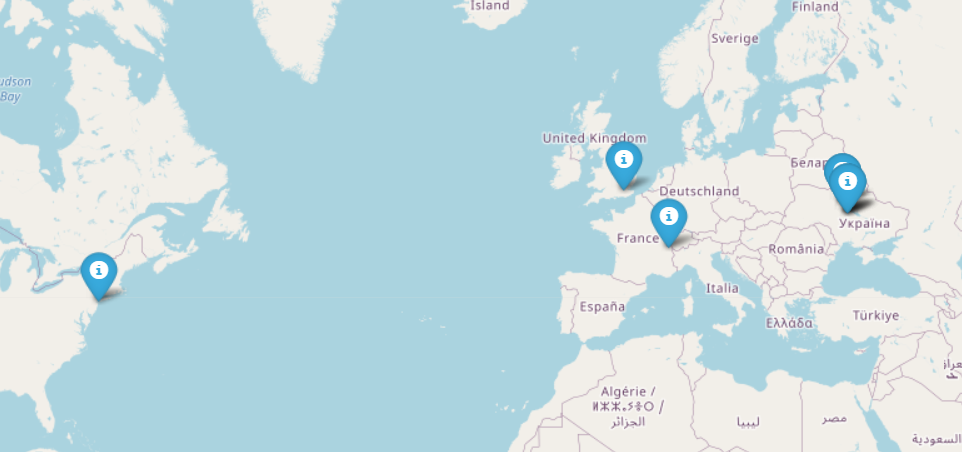

# twitter_map
Twitter_map is an app, which takes name of the Twitter's user and token and return a generated map with locations of users' friends and their names.
## Usage
Run program.py to make the application work.
## 
Here is an example, how map can look like:
